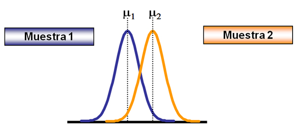

# Pruebas de hipótesis
***
La prueba de hipótesis estadística es un proceso que le permite evaluar si un cambio o una diferencia observada en un conjunto de datos es "real", o si es solo el resultado de una fluctuación aleatoria en los datos.

La prueba de hipótesis puede ser un componente integral de cualquier proceso de toma de decisiones. Proporciona un marco para evaluar la confianza que uno puede tener al sacar conclusiones basadas en datos. Algunos casos en los que esto puede surgir incluyen:

Un profesor espera que el promedio de un examen sea aproximadamente del 75% y quiere saber si los puntajes reales se alinean con esta expectativa. ¿Fue la prueba realmente demasiado fácil o demasiado difícil? un gerente de producto de un sitio web desea comparar el tiempo dedicado a las diferentes versiones de una página de inicio. ¿Una versión hace que los usuarios permanezcan en la página mucho más tiempo?

Generamos de manera aleatoria una población
```r
# generate random population
population <- rnorm(300, mean=65, sd=3.5)
```
Una vez genedara calculamos la media
```r
# calculate population mean here:
population_mean <- mean(population)
population_mean
```
Generaremos la muestra | con una población de 30
```r
# generate sample 1
sample_1 <- sample(population, size=30)
sample_1
```
Con la población generada calcularemos la media de la muestra 1
```r
# calculate sample 1 mean
sample_1_mean <- mean(sample_1)
sample_1_mean
```
Generamos 4 muestras, todas con tamaño de 30
```r
# generate samples 2,3,4 and 5
sample_2 <- sample(population, size=30)
sample_3 <- sample(population, size=30)
sample_4 <- sample(population, size=30)
sample_5 <- sample(population, size=30)
```
Ahora calculamos la media de nuestras muestras
```r
# calculate sample means here:
sample_2_mean <- mean(sample_2)
sample_2_mean
sample_3_mean <- mean(sample_3)
sample_3_mean
sample_4_mean <- mean(sample_4)
sample_4_mean
sample_5_mean <- mean(sample_5)
sample_5_mean
```
Una vez calculadas las muestras haremos el primer experimento
```r
# experiment 1
hypo_a <- "DeePressurize lowers blood pressure in patients."
hypo_b <- "DeePressurize has no effect on blood pressure in patients."
null_hypo_1 <- "hypo_b"
```
Hacemos la hipotesis de nuestro experimento 2
```r
# experiment 2
hypo_c <- "The new profile layout has no effect on number of matches with other users."
hypo_d <- "The new profile layout results in more matches with other users than the original layout."
null_hypo_2 <- "hypo_c"
```
Se calcula la mean retriever y la mean doodle
```r
# calculate mean_retriever_l and mean_doodle_l here:
mean_retriever_l<- mean(retriever_lengths)
mean_doodle_l<- mean(doodle_lengths)
```
Calcularemos la diferencia de las medias
```r
# calculate mean_difference here:
mean_difference<- mean_retriever_l - mean_doodle_l
```
Se asignan los supuestos de nuestras hipotesis que vamos a evaluar
```r
# statements:
st_1 <- "The average length of Golden Retrievers is 2.5 inches longer than the average length of Goldendoodles."
st_2 <- "The average length of Golden Retrievers is the same as the average length of Goldendoodles."

# update null_hypo here:
null_hypo <- "st_2"
```
Definimos los posibles errores que podemos tener en nuestras supuestos
```r
# define type_i_errors and type_ii_errors here:
type_i_errors <- intersect(experimental_positive, actual_negative)
type_i_errors
type_ii_errors <- intersect(experimental_negative, actual_positive)
type_ii_errors
```
Asignamos ciertas interpretaciones que pueden ser posibles en nuestras hipotesis
```r
# possible interpretations
st_1 <- "There is a 20% chance that the difference in average weight of green and red apples is due to random sampling."
st_2 <- "There is a 20% chance that green and red apples have the same average weight."
st_3 <- "There is a 20% chance red apples weigh more than green apples."
st_4 <- "There is a 20% chance green apples weigh more than green apples."

# update the value of interpretation here:
interpretation <- "st_1"
```
Hacemos update de la hipotesis
```r
# update reject_hypothesis here:
reject_hypothesis <- FALSE
```
Mensaje en caso de salir false en edad
```r
# load and view data
load("ages.Rda")
ages
```
Calculamos la media de las edades
```r
# calculate ages_mean here:
ages_mean <- mean(ages)
```
Hacemos una prueba de la muestra de edades
```r
# perform t-test here:
results <- t.test(ages, mu = 30)
```
Mensaje que mostramos en caso de resultar false
```r
# load data
load("week_1.Rda")
week_1
load("week_2.Rda")
week_2
```
Calculos de la media de la semana 1 y dos
```r
# calculate week_1_mean and week_2_mean here:
week_1_mean<- mean(week_1)
week_2_mean<- mean(week_2)
```
Calculos de la desviación estandar de la semana 1 y dos
```r
# calculate week_1_sd and week_2_sd here:
week_1_sd <- sd(week_1)
week_2_sd <- sd(week_2)
```
Corremos dos muestras de nuestros calculos de la semana 1 y 2
```r
# run two sample t-test here:
results <- t.test(week_1,week_2)
```
Calculamos la media en "store"
```r
# calculate means here:
store_a_mean <- mean(store_a)
store_a_mean
store_b_mean <- mean(store_b)
store_b_mean
store_c_mean <- mean(store_c)
store_c_mean
```
Calculo de la desviación estandar
```r
# calculate standard deviations here:
store_a_sd <- sd(store_a)
store_a_sd
store_b_sd <- sd(store_b)
store_b_sd
store_c_sd <- sd(store_c)
store_c_sd
```
Realizamos dos muestras de nuestras hipotesis
```r
# perform two sample t-test here:
a_b_results <- t.test(store_a,store_b)
a_b_results
a_c_results <- t.test(store_a,store_c)
a_c_results
b_c_results <- t.test(store_b,store_c)
b_c_results
```
Calculos de la probabilidad que tenemos de equivocarnos en nuestros supuestos
```r
# calculate error_prob here:
error_prob <- (1-(0.95**3))
error_prob
```
Mensaje desplegado en caso de resultar "false"
```r
# load data
load("stores.Rda")
load("stores_new.Rda")
```
Realizamos una visualización en store
```r
# inspect stores here:
stores
```
Resultados de los datos de store
```r
# perform anova on stores here:
results <- aov(sales ~ store, data = stores)
results
summary(results)
```
Nuevos resultados de store
```r
# perform anova on stores_new here:
results_new <- aov(sales ~ store, data = stores_new)
results_new
summary(results_new)
```
Mensaje que se desplegará en caso de resultar false nuestra hipotesis
```r
# load data
load("dist_one.Rda")
load("dist_two.Rda")
load("dist_three.Rda")
load("dist_four.Rda")
```
Desplegamos los histogramas para poder ver el resultado visualmente sobre nuestras hipotesis
```r
# plot histograms and define not_normal here:
hist(dist_one)
hist(dist_two)
hist(dist_three)
hist(dist_four)

not_normal <- 4
```
Definimos el radio
```r
# define ratio here:
ratio <- sd(dist_two) / sd(dist_three)
ratio
```