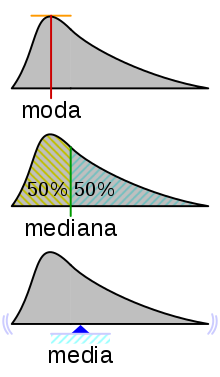

# Media
***
La media, también conocida como promedio, es el valor que se obtiene al dividir la suma de un conglomerado de números entre la cantidad de ellos.

Algunas características de la media son:

- Considera todas las puntuaciones
- El numerador de la fórmula es la cantidad de valores
- Cuando hay puntuaciones extremas, no tiene una representación exacta de la muestra



Se identifican los valores a tomar en cuenta, se suman y se dividen por la cantidad de valores tomados en cuenta
```r
total <- 29 + 49 + 42 + 43
print(total)

mean_value <- total / 4
```
Con la función mean se puede hacer facilmente el calculo de la media sin tener que hacer el calculo manual mente
```r
# Set author ages to a vector
author_ages <- greatest_books$Ages

# Use R to calculate mean
average_age <- mean(author_ages)
print(average_age)
```
# Mediana
***
La mediana es un conjunto es un valor que se encuentra a la mitad de los otros valores, es decir, que al ordenar los número de menor a mayor, éste se encuentra justamente en medio entre los que están por arriba.
Algunas características de la media son:
- Las operaciones para calcular el valor son muy sencillas de realizar.
- La medida no depende de los valores de las variables, solamente de su orden.
- Generalmente, los valores son enteros.
- Se puede calcular aunque los números que se encuentren arriba y abajo no tengan límites.

## Ejercicio
***
Calcularemos la mediana, para eso haremos un arreglo con las edades de los primeros 5 autores
```r
# Array of the first five author ages
five_author_ages <- c(29, 49, 42, 43, 32)
```
Primero es necesario organizar nuestro arreglo de manera ascendente
```r
# Fill in the empty array with the values sorted
sorted_author_ages <- c(29, 32, 42, 43, 49)
```
Ya que calculamos el valor de la mediana, lo guardamos
```r
# Save the median value to median_value
median_value <- 42
```
Desplegaremos nuestro arreglo ya organizado y el valor de la mediana
```r
# Print the sorted array and median value
cat("The sorted array is:", sorted_author_ages)
cat(paste("The median of the array is: ", median_value))
```
Cargamos el data frame con el que estaremos trabajando en este caso el "top-hundred-books"
```r
# Load data frame
greatest_books <- read_csv('top-hundred-books.csv')
```
Guadaremos la edad de los autores y calcularemos la mediana del top 100 de los autores de los libros, seguido imprimiremos el resultado
```r
# Save author ages to author_ages
author_ages <- greatest_books$Ages

# Use R to calculate the median age of the top 100 authors
median_age <- median(author_ages)


print(paste("The median age of the 100 greatest authors, according to a survey by Le Monde is: " , median_age))
```
# Moda
***
La moda es el valor que aparece más dentro de un conglomerado. En un grupo puede haber dos modas y se conoce como bimodal, y más de dos modas o multimodal cuando se repiten más de dos valores; se llama amodal cuando en un conglomerado no se repiten los valores.

Por último, se conoce como moda adyacente cuando dos valores continuos tienen la misma cantidad de repeticiones. En este caso se saca el promedio de ambos.

Las principales características de la moda son:

- Es una muestra muy clara
- Las operaciones para determinar el resultado son muy fáciles de elaborar
- Los valores que se presentan pueden ser cualitativos y cuantitativos

Aplicamos la moda para la edad de 27 años
```r
mode_age <- 27
mode_count <- 2
```
Cargamos el data frame que vamos a leer y utilizar para la moda Mostramos cual es la moda en la edad y desplegamos la moda del top 100 de los mejores libros
```r
# Read author data
greatest_books = read_csv("top-hundred-books.csv")

# Set author ages to 
author_ages <- greatest_books$Ages

mode_age <- Mode(author_ages)

print(paste("The mode age of authors from Le Monde's 100 greatest books is: ", mode_age[1]))
```