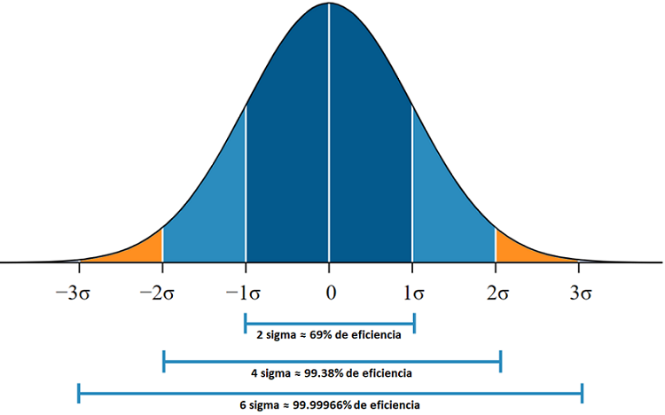

# Distancia de la media
***
Cargamos nuestra data
```r
# load data
grades <- c(88, 82, 85, 84, 90)
mean <- mean(grades)
```
Cambiamos las 5 variables
```r
#Change these five variables
difference_one <- 88 - mean
difference_two <- 82 - mean
difference_three <- 85 - mean
difference_four <- 84 - mean
difference_five <- 90 - mean
```
Sacamos el promedio de las distancias (con la media)
```r
difference_one <- 88 - mean
difference_two <- 82 - mean
difference_three <- 85 - mean
difference_four <- 84 - mean
difference_five <- 90 - mean
```
Primero sumaremos las distancias, después se le aplicará el promedio a la suma de las distancia
```r
#Part 1: Sum the differences
difference_sum <- difference_one + difference_two + difference_three + difference_four + difference_five

#Part 2: Average the differences
average_difference <- difference_sum / 5 
```
Nuestras variables las elevamos a la potencia 2
```r
#Change these five variables
difference_one <- (88 - mean) ^ 2
difference_two <- (82 - mean) ^ 2
difference_three <- (85 - mean) ^ 2
difference_four <- (84 - mean) ^ 2
difference_five <- (90 - mean) ^ 2
```
Utilizando la libreria numpy pondremos dos variables iguales a la varianza
```r
#Set these two variables equal to the variance of each dataset using NumPy
teacher_one_variance <- variance(teacher_one_grades)
teacher_two_variance <- variance(teacher_two_grades)
```

# Desviación estandar
***
La desviación estándar es la medida de dispersión más común, que indica qué tan dispersos están los datos con respecto a la media. Mientras mayor sea la desviación estándar, mayor será la dispersión de los datos.

El símbolo σ (sigma) se utiliza frecuentemente para representar la desviación estándar de una población, mientras que s se utiliza para representar la desviación estándar de una muestra. La variación que es aleatoria o natural de un proceso se conoce comúnmente como ruido.

La desviación estándar se puede utilizar para establecer un valor de referencia para estimar la variación general de un proceso.



Importaremos data y calcularemos la varianza
```r
# Importing data and calculating variance
load("lesson_data.Rda")
variance <- function(x) mean((x-mean(x))^2)

nba_variance <- variance(nba_data)
okcupid_variance <- variance(okcupid_data)
```
Cambiaremos las variables para que sean la desviación estandar de todos los datos
```r
# Change these variables to be the standard deviation of each dataset.
nba_standard_deviation <- nba_variance ^ .5
okcupid_standard_deviation <- okcupid_variance ^ .5
```

Cargamos el data que utilizaremos
```r
# Import data
load("lesson_data.Rda")
```
Cambiaremos las variables para que sean la desviación estandar de todos los datos
```r
# Change these variables to be the standard deviation of each dataset.
nba_standard_deviation <- sd(nba_data)
okcupid_standard_deviation<- sd(okcupid_data)
```
Importamos el data que vamos a utilizar y calculamos la varianza
```r
# Importing data and calculating variance
load("lesson_data.Rda")
variance <- function(x) mean((x-mean(x))^2)

nba_mean <- mean(nba_data)
okcupid_mean <- mean(okcupid_data)
nba_standard_deviation <- sd(nba_data)
okcupid_standard_deviation <- sd(okcupid_data)
```
El paso 1 sera calcular la diferencia entre la altura del jugar y la media
```r
nba_difference <- 65 - nba_mean
okcupid_difference <- 65 - okcupid_mean
```
El paso 2 sera usar la diferencia entre el punto y la media apra encontrar cuántas desviaciones estandar esta el de jugar de la media
```r
#Step 2: Use the difference between the point and the mean to find how many standard deviations the player is away from the mean.
num_nba_deviations <- nba_difference / nba_standard_deviation
num_okcupid_deviations <- okcupid_difference / okcupid_standard_deviation
```