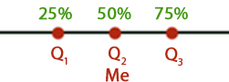
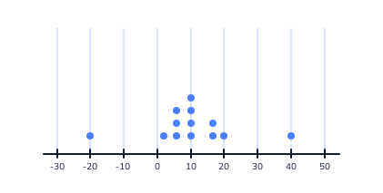

# Cuartiles
***
Los cuartiles son una herramienta que se usan en la estadística y que sirven para administrar grupos de datos previamente ordenados.

Los cuartiles son los tres valores de la variable que dividen a un conjunto de datos ordenados en cuatro partes iguales.

Q1, Q2 y Q3 determinan los valores correspondientes al 25%, al 50% y al 75% de los datos. Q2 coincide con la mediana.

A continuación lo que haremos primero es cargar crear nuestro data set uno y lo vamos a organizar
```r
dataset_one <- c(50, 10, 4, -3, 4, -20, 2)
# sorted dataset_one: c(-20, -3, 2, 4, 4, 10, 50)
```
Seguido crearemos nuestro segundo data set
```r
dataset_two <- c(24, 20, 1, 45, -15, 40)
```
Aquí vamos a definir el segundo cuartil de ambos dataset
```r
# define the second quartile of both datasets here:
dataset_one_q2 <- 4
dataset_two_q2 <- 22
```
Le asignamos los valores a nuestro data set uno y dos, después los organizamos de manera ascendente y definiremos el segundo cuartil
```r
dataset_one <- c(50, 10, 4, -3, 4, -20, 2)
# sorted dataset_one: [-20, -3, 2, 4, 4, 10, 50]

dataset_two <- c(24, 20, 1, 45, -15, 40)
# sorted dataset_one: [-15, 1, 20, 24, 40, 45 ]

dataset_one_q2 <- 4
dataset_two_q2 <- 22
```
Ahora definiremos nuestro tercer cuartil de ambos data set y su valor
```r
# define the first and third quartile of both datasets here:
dataset_one_q1<- -3
dataset_one_q3<- 10

dataset_two_q1<- 1
dataset_two_q3<- 40
```
Aquí lo que haremos sera organizar nuestros data set, seguidamente definiremos del primer al tercer cuartil de ambos data set
```r
dataset_one <- c(50, 10, 4, -3, 4, -20, 2)
# sorted dataset_one: [-20, -3, 2, 4, 4, 10, 50]

dataset_two <- c(24, 20, 1, 45, -15, 40)

dataset_one_q2 <- 4
dataset_two_q2 <- 22

# define the first and third quartile of both datasets here:
dataset_one_q1 <- -0.5
dataset_one_q3 <- 7

dataset_two_q1 <- 1
dataset_two_q3 <- 40
```
Cargamos nuestra data
```r
# load song data
load("songs.Rda")
```
Creamos tres variables haciendo referencia cada una a un cuartil respectivamente
```r
# create the variables songs_q1, songs_q2, and songs_q3 here:
songs_q1 <- quantile(songs,0.25)
songs_q2 <- quantile(songs,0.5)
songs_q3 <- quantile(songs,0.75) 
```
Creamos una variable y el cuartil
```r
# create the variables favorite_song and quarter here:
favorite_song <- 300
quarter <- 4
```

# Cuantiles
***
Los cuantiles son puntos que dividen un conjunto de datos en grupos de igual tamaño. Por ejemplo, supongamos que acaba de realizar una prueba y desea saber si está en el 10% superior de la clase. Una forma de determinar esto sería dividir los datos en diez grupos con un número igual de puntos de datos en cada grupo y ver a qué grupo pertenece.

Hay nueve valores que dividen el conjunto de datos en diez grupos de igual tamaño: cada grupo tiene 3 puntajes de prueba diferentes.

¡Esos nueve valores que dividen los datos son cuantiles! Específicamente, son los 10-cuantiles o deciles.

Puede encontrar cualquier cantidad de cuantiles. Por ejemplo, si divide el conjunto de datos en 100 grupos de igual tamaño, los 99 valores que dividen los datos son los 100 cuantiles o percentiles.

Los cuartiles son algunos de los cuantiles más utilizados. Los cuartiles dividen los datos en cuatro grupos de igual tamaño.

Cargamos nuestra data
```r
# load song data
load("songs.Rda")
```
Definimos nuestro percentile
```r
# define twenty_third_percentile here:
twenty_third_percentile <- quantile(songs, 0.23)
```
Cargamos nuestra data
```r
# load song data
load("songs.Rda")
```
Definimos los cuartiles
```r
# define quartiles and deciles here:
quartiles <- quantile(songs,c(0.25,0.5,0.75))
deciles <- quantile(songs,c(0.1,0.2,0.3,0.4,0.5,0.6,0.7,0.8,0.9))
```
Definiremos nuestra variable "tenth"
```r
# define tenth here:
tenth <- 3
```
Cargamos nuestra data
```r
# load song data
load("songs.Rda")
```
Definiremos nuestro percentil junto a su respuesta
```r
# define percentile and answer here:
percentile <- quantile(songs,0.32)
answer <- "below"
```

# Rango Intercuartil
***
Una de las estadísticas más comunes para describir un conjunto de datos es el rango. El rango de un conjunto de datos es la diferencia entre los valores máximo y mínimo. Si bien esta estadística descriptiva es un buen comienzo, es importante considerar el impacto que tienen los valores atípicos en los resultados:

En esta imagen, la mayoría de los datos se encuentran entre 0 y 15. Sin embargo, hay un valor atípico negativo grande (-20) y un valor atípico positivo grande (40). Esto hace que el rango del conjunto de datos sea 60 (la diferencia entre 40 y -20). ¡Eso no es muy representativo de la distribución de la mayoría de los datos!

El rango intercuartílico (IQR) es una estadística descriptiva que intenta resolver este problema. El IQR ignora las colas del conjunto de datos, por lo que conoce el rango alrededor del cual se centran sus datos.

Buscamos la duración máxima y minima de la canción con las funciones "max" y min"

```r
# find maximum and minimum song lengths
maximum <- max(songs)
minimum <- min(songs)
```
Crearemos una variable llamada "song_range"
```r
# create variable song_range here:
song_range<- maximum - minimum
```
Aquí buscaremos al primero cuartil
```r
# find the first quartile
q1 <- quantile(songs,0.25)
```
Lo que haremos a continuación es calcular el tercer cuartil
```r
# calculate the third quartile here:
q3 <- quantile(songs,0.75)
```
Calculamos el rango del intercuartil
```r
# calculate the interquartile range here:
interquartile_range <- q3-q1
```
Cargamos el data
```r
# load song data
load("songs.Rda")
```
Crearemos la variables "intercuartile_range"
```r
# create the variable interquartile_range here
interquartile_range<- IQR(songs)
```